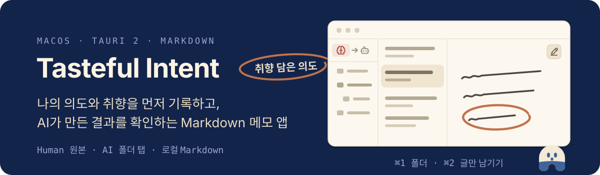
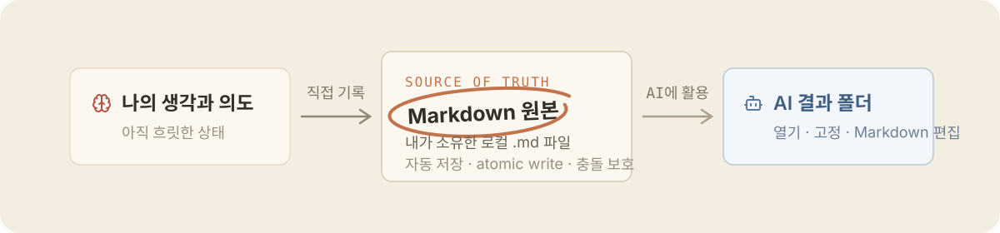

<p align="center"><a href="./README.md">English</a> | 한국어</p>

<p align="center">
  <picture>
    <source media="(max-width: 600px)" srcset="./assets/readme/hero-ko-mobile.svg">
    
  </picture>
</p>

<p align="center">
  <a href="https://github.com/tkhwang/tasteful-intent/actions/workflows/ci.yml"></a>
  <a href="https://github.com/tkhwang/tasteful-intent/releases"></a>
  
  
</p>

<p align="center">
  나의 언어로 의도를 쓰고 로컬 Markdown으로 보관합니다.<br>
  AI가 만든 결과는 원본과 분리된 작업 공간에서 엽니다.
</p>

## 의도에서 결과까지

Prompt는 요청할 때마다 달라지지만, 의도와 취향은 요청이 달라도 유지됩니다. Tasteful Intent는 그 원천을 Human 작업 공간에 보관하고 AI가 만든 Markdown은 별도 AI 작업 공간에서 확인할 수 있게 합니다.

<p align="center">
  <picture>
    <source media="(max-width: 600px)" srcset="./assets/readme/original-first-ko-mobile.svg">
    
  </picture>
</p>

앱은 LLM을 직접 실행하거나 메모를 전용 데이터베이스로 복사하지 않습니다. 선택한 폴더에서 직접 읽고 씁니다.

## 빠른 시작

Homebrew로 서명된 macOS 앱을 설치합니다.

```bash
brew install --cask tkhwang/tap/tasteful-intent
```

앱을 열어 언어와 화면 설정을 고른 뒤 Human 폴더를 연결합니다. AI 공간에 처음 들어갈 때 AI가 만든 Markdown이 있는 폴더를 선택합니다.

Apple silicon과 Intel용 DMG는 [Releases 페이지](https://github.com/tkhwang/tasteful-intent/releases)에서도 받을 수 있습니다.

## 할 수 있는 일

- CodeMirror 6와 GFM rendering으로 Human 메모를 작성합니다. 500ms 자동 저장과 atomic write를 사용하고 외부 변경 충돌을 막습니다.
- 여러 AI 폴더를 tab으로 엽니다. 자주 쓰는 root는 한두 글자 label로 고정하고 폴더별 문서 session을 복원합니다.
- 여러 문서를 열고 각각 `Edit → View → Split` mode를 전환합니다. Human 문서는 Edit, AI 문서는 View로 시작합니다.
- `⌘F` 또는 `Ctrl+F`로 현재 문서를 검색하고 Edit, View, Split에서 결과를 강조합니다.
- root-relative 로컬 이미지를 10 MiB까지 표시하고 현재 문서의 rendering 결과를 PDF로 내보냅니다.
- 최신순과 제목순으로 정렬하고 문서 목록 밀도를 Full, Medium, Simple로 전환합니다.
- Keyboard로 접근 가능한 context menu에서 Human 파일과 폴더를 만들고, 이름을 바꾸고, 이동하고, 시스템 휴지통으로 보냅니다.
- 3-pane, 2-pane, content-only mode를 사용합니다. 영어·한국어 UI와 테마 4개, Human·AI 색상 조합 4개, 글꼴 2개를 제공합니다.

AI 폴더에서는 Markdown을 편집할 수 있지만 파일 구조를 바꾸는 작업은 지원하지 않습니다. Workspace 전체 검색, tag, Markdown toolbar, 첨부파일 관리, wiki/backlink, 동기화, 계정, 내장 LLM runtime은 현재 범위에 포함되지 않습니다.

## 로컬 파일이 원본입니다

파일명이 문서 제목입니다. Tasteful Intent는 선택한 모든 root를 canonicalize하고 파일 작업을 해당 경계 안으로 제한합니다. 숨김 경로와 symlink를 제외하며 AI 폴더를 탐색할 때 `.gitignore`와 `.ignore`를 따릅니다.

AI folder tab을 닫아도 앱 설정만 바뀌며 폴더와 파일은 삭제되지 않습니다. Human 삭제는 영구 삭제 대신 macOS 휴지통을 사용합니다. 설정은 bundle ID `app.tkbetter.intentmemo`의 OS app-data 위치에 저장됩니다.

<details>
<summary>새 Human 문서 형식</summary>

새 문서는 `created`, `updated` timestamp와 빈 본문으로 시작합니다.

```markdown
---
created: 2026-08-02T00:00:00.000Z
updated: 2026-08-02T00:00:00.000Z
---
```

</details>

## 단축키

| 동작 | 단축키 |
| --- | --- |
| 현재 문서 검색 | `⌘F` 또는 `Ctrl+F` |
| 폴더 pane 전환 | `⌘1` |
| Content-only mode 전환 | `⌘2` |

## 개발

Node.js 20+, pnpm, Rust, [Tauri 사전 요구 사항](https://v2.tauri.app/start/prerequisites/)이 필요합니다.

```bash
pnpm install
pnpm tauri:dev
```

변경 사항을 제출하기 전에 repository check를 실행합니다.

```bash
pnpm check
pnpm test
pnpm build
cargo test --manifest-path src-tauri/Cargo.toml
cargo clippy --manifest-path src-tauri/Cargo.toml --all-targets --all-features -- -D warnings
pnpm tauri:build
```

`pnpm check`는 파일을 수정하지 않습니다. 직접 formatting하려면 `pnpm biome check --write .`을 실행합니다.

## 기술 스택

Desktop shell과 filesystem boundary는 Tauri 2와 Rust로 구현합니다. Interface에는 React 19, TypeScript, CodeMirror 6, react-markdown, remark-gfm, Biome, Vitest를 사용합니다.

<details>
<summary>릴리스 자동화</summary>

Release Please가 버전과 changelog를 관리합니다. Conventional commit이 `main`에 merge되면 release PR을 열거나 갱신합니다. 이 PR을 merge하면 `v*` GitHub release를 발행하고, Apple silicon과 Intel용 macOS DMG를 서명·공증해 updater artifact와 함께 첨부한 뒤 checksum을 반영한 cask를 `tkhwang/homebrew-tap`에 올립니다.

Workflow는 release PR에 `RELEASE_PLEASE_TOKEN`, desktop artifact에 Apple·Tauri signing secret, Homebrew tap에 `TAP_GITHUB_TOKEN`을 사용합니다.

</details>
