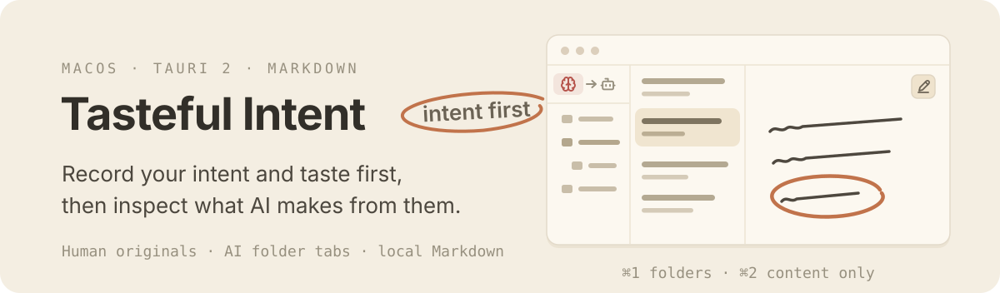
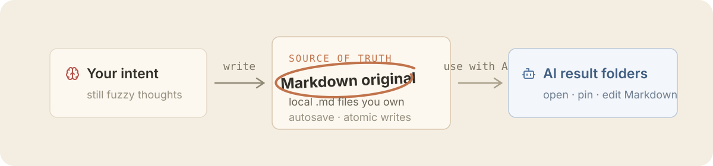

<p align="center">English | <a href="./README.ko.md">한글</a></p>

<p align="center">
  
  
  
  
  
  
  
</p>

<p align="center">
  
</p>

**Tasteful Intent (취향 담은 의도)** is a minimal Markdown desktop app for recording your intent and taste, handing them to AI, and reviewing what AI makes. The Markdown files in the folder you choose are the source; the app keeps that source easy to write, read, and manage.

## Why intent, not prompts

Your intent and taste are the source of every result. Tasteful Intent keeps that source clear before you hand it to AI and inspect the outcome.

<p align="center">
  
</p>

- It starts from Markdown editor fundamentals: fast and safe writing, autosave, and local originals you own.
- On top of that, it gradually adds writing conveniences that help make intent concrete — purpose, background, constraints, and completion criteria.
- AI features will be considered only in later versions, as a derived layer that never replaces what a human wrote.

## v0.2

- Two read-write Markdown spaces: **Human** for the intent you write yourself, **AI** for what AI produces from it
- Independent local roots per space, with the `Human → AI` switcher always at the top of the sidebar — in the folder pane, or above the document list when folders are collapsed
- Multiple document tabs with space-specific session restore and a per-tab `Edit → View → Split(Edit | View)` mode cycle; Human opens in Edit, AI in View
- Create, rename, and move documents and folders; delete to the system Trash
- Keyboard-accessible context menus for rename, move, and Trash actions
- CodeMirror 6 Markdown syntax highlighting
- Per-document 500 ms autosave, atomic writes, external-change conflict protection, and save barriers before space switch or app close
- `⌘1` folder pane toggle, `⌘2` content-only mode
- English-default UI with a Korean option, plus Light · Two-Tone · Dark · System themes and Sans-serif/Serif writing typography. Application chrome stays Sans-serif; Typography affects only Markdown editing/rendering and large empty-state copy

Search, tags, a Markdown toolbar, images, wiki/backlinks, an LLM runtime, and AI-managed folders are follow-up scope.

## Install

```bash
brew install --cask tkhwang/tap/tasteful-intent
```

Or download the signed `.dmg` from [Releases](https://github.com/tkhwang/tasteful-intent/releases).

## Data

On first run you pick the Human space's `libraryRoot`; the AI space's `docsRoot` is chosen when you first enter AI. The filename is the source of truth for a document's title, and new documents start with minimal frontmatter and an empty body.

```markdown
---
created: 2026-08-02T00:00:00.000Z
updated: 2026-08-02T00:00:00.000Z
---
```

Hidden paths and symlinks are not traversed. Deletion uses the operating system Trash instead of permanent deletion. Settings are stored as `settings.json` in the OS app-data location for bundle ID `app.tkbetter.intentmemo`.

## Development

Prerequisites: Node.js 18+, pnpm, Rust, and the [Tauri prerequisites](https://v2.tauri.app/start/prerequisites/).

```bash
pnpm install
pnpm tauri:dev
```

```bash
pnpm check
pnpm test
pnpm build
cargo test --manifest-path src-tauri/Cargo.toml
pnpm tauri:build
```

`pnpm check` is non-mutating. Use `pnpm biome check --write .` when formatting is intended.

## Release

Releases are automated with release-please. Conventional commits merged into `main` open (or update) a release PR that bumps `package.json`, `src-tauri/tauri.conf.json`, `src-tauri/Cargo.toml`, and `src-tauri/Cargo.lock` and maintains the changelog. Merging that release PR publishes the `v*` GitHub release, which builds the signed macOS DMGs, uploads them to the release, and renders `distribution/homebrew/tasteful-intent.rb` with checksums into `tkhwang/homebrew-tap`.

The automation needs two repository secrets: `RELEASE_PLEASE_TOKEN` (Contents, Pull requests, and Issues write on this repo) and `TAP_GITHUB_TOKEN` (Contents write on the tap).

## Stack

- Tauri 2 / Rust
- React 19 / TypeScript
- CodeMirror 6
- react-markdown + remark-gfm
- Biome / Vitest
